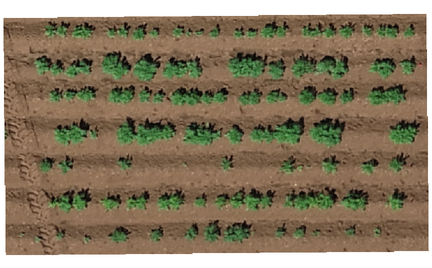
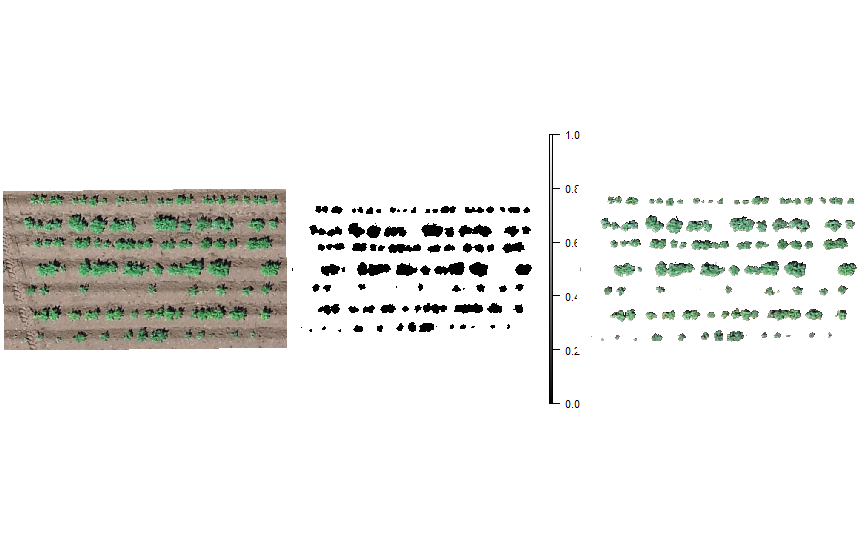
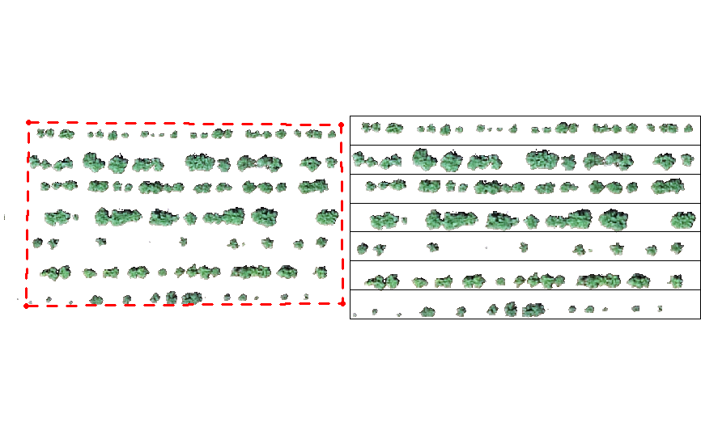
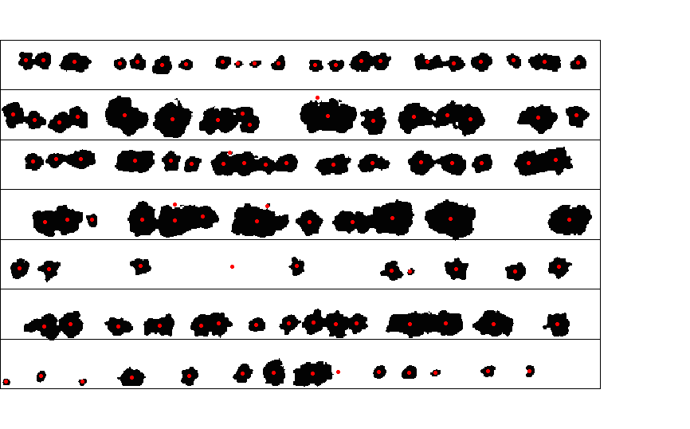
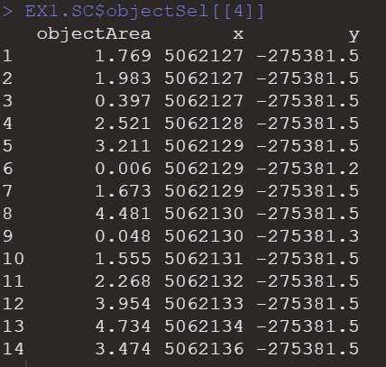

# Canopy-Object-Analysis

## Load library
```
library(raster)
library(FIELDimageR)
```

## Load image
```
EX.SC <-stack("EX_StandCount.tif")
plotRGB(EX.SC, r = 1, g = 2, b = 3)
```
<!-- -->

## Removing the soil
```
EX.SC.RemSoil <- fieldMask(mosaic = EX.SC, Red = 1, Green = 2, Blue = 3, index = "HUE")
```
<!-- -->

## Building the plot shapefile (ncols = 1 and nrows = 7)
```
EX.SC.Shape <- fieldShape(mosaic = EX.SC.RemSoil,ncols = 1, nrows = 7)
```
<!-- -->

## When all shapes are counted: minSize = 0.00
```
EX1.SC <-fieldCount(mosaic = EX.SC.RemSoil$mask, 
                   fieldShape = EX.SC.Shape$fieldShape,
                   minSize = 0.00)
```
<!-- -->

## Object Area
```
EX1.SC$objectSel[[4]]
```
<!-- -->

## No shape rejected because minSize = 0.00
```
EX1.SC$objectReject[[4]]
```

## Change minSize = 0.04
```
EX1.SC<-fieldCount(mosaic = EX.SC.RemSoil$mask, 
                   fieldShape = EX.SC.Shape$fieldShape,
                   minSize = 0.04)
```

## Object Area > 0.04
```
EX1.SC$objectSel[[4]]
```